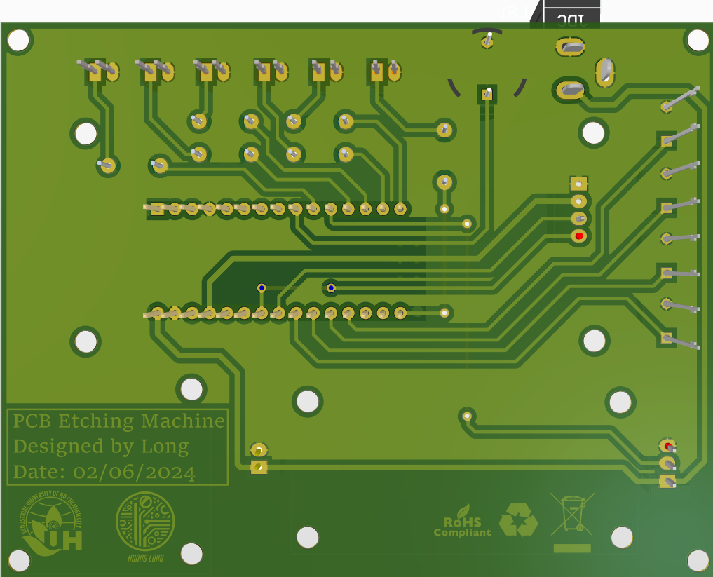

# Telephone Landline

    

    

# Soldering Station

    

    

# PCB Etching Machine

    

    

# Multiple Power Supply

    

    

# ARPoLAN
Original schematic: [cifertech/ARPoLAN](https://github.com/cifertech/ARPoLAN)

    

    

# nRF Box
Original schematic: [cifertech/nRFBox](https://github.com/cifertech/nRFBox)

    

    

# INDOOR AIR QUALITY MONITORING AND CONTROL SYSTEM

    

    

